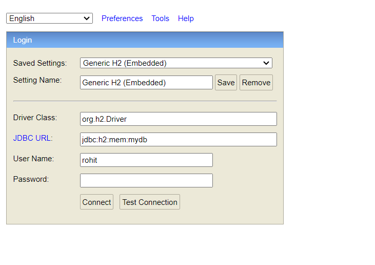

 
--------------------------------------
**This is a Spring Boot Application**

Mock Data Setup is already present at start of Application

There are two APIs in this service

_**One to Persist Customer and Address info (Address belongs to customer)**_

**Curl**

`curl --location --request POST 'localhost:8080/customer/save' \
--header 'Content-Type: application/json' \
--data-raw '{
"firstName" : "Fort",
"lastName" : "Tch",
"addressesList" : [
{
"address1" : "example2",
"type" : "HOME",
"city" : "GAME CITY",
"state": "West ",
"zipcode" : "713301"
},
{
"address1" : "example2",
"type" : "OFFICE",
"city" : "gAME URBAN",
"state" : "Mysore",
"zipcode" : "465645"
}
]
}'
`

Note :

This is also publishing the message via Kafka Producer to a topic named **customer-process**
Either comment out line
**kafkaProducer.sendMessage(savedCustomer);** or have Zookeeper and Broker running at port 9092 to run this API
 -------------------------------------------------------------------------------------------

**_Another to get Customers List(No Filter/ Filter by one param/ filter by multiple param)
i.e., name, city and state_**

**Curl**

Import Curl on PostMan

`curl --location --request GET 'localhost:8080/customer/list?name=PM&city=Ba&state=New'`

To view DB

Login to H2 Console
http://localhost:8080/h2-console

* JDBC URL : jdbc:h2:mem:mydb
* UserName : rohit
* password: rohit

Some Important small facts
Extend auditable data from customer entity to capture audit logs.

AuditableData class should have @MappedSuperClass since it is Base Entity .BaseEntityClass are entity which dont have
tbl of its own but have coloumn names used by other classes . They hold common properites of multiple entity class.
which is extended by other entities .It is provided by JAKARTA Persistence

Super Builder is used with Customer class becuase it extends Auditable Data and to initialize data with audit in
customer @super builder is used

@JsonIdentityInfo is an annotation provided by the Jackson library, which is a popular JSON processing library in Java.
This annotation is used to handle circular references or self-references in JSON serialization and deserialization.

@JsonManagedReference and @JsonBackReference
Purpose:

Used to manage bidirectional relationships in object graphs, specifically to handle serialization and deserialization of
these relationships to avoid infinite recursion.
Usage:

@JsonManagedReference is used on the "forward" part of the reference (the part that is serialized normally).
@JsonBackReference is used on the "back" part of the reference (the part that should not be serialized to avoid
recursion).